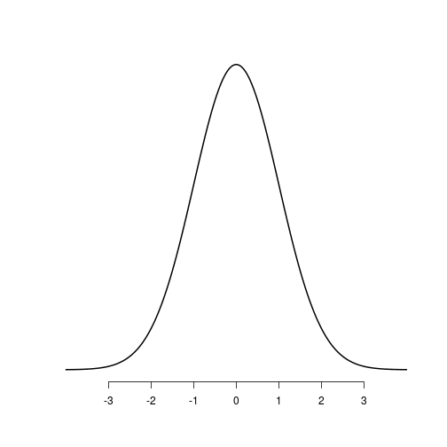
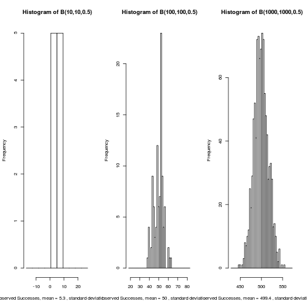
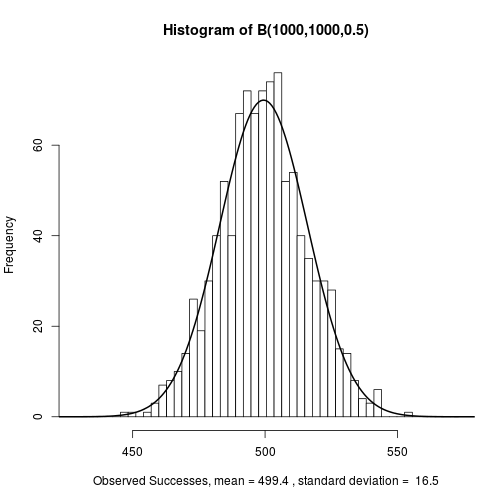
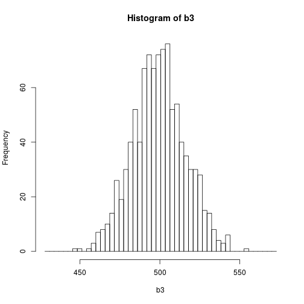

## Slide 1

The central limit theorem states that the distribution of the mean of a large number of independent, identically distributed variables will be approximately normal, regardless of underlying distribution of the variables.

--- 

## Slide 2

The Binomial Simulator (http://github.com/wongjo/data-products) generates a large number of independent, identically distributed variables, so will be approximately normal when the number of trials and observations is large.

--- 

## Slide 3

The Binomial Simulator will allow the user to explore the parameters of the binomial random number generator and large numbers of trials and observations will approach the normal distribution, and can be compared to the normal curve with the overlay display.

--- 

## Slide 4

Other Customizable options are available

--- 

## Slide 5

The Binomial Simulator is a valuable tool for students of probabilty and statistics.

